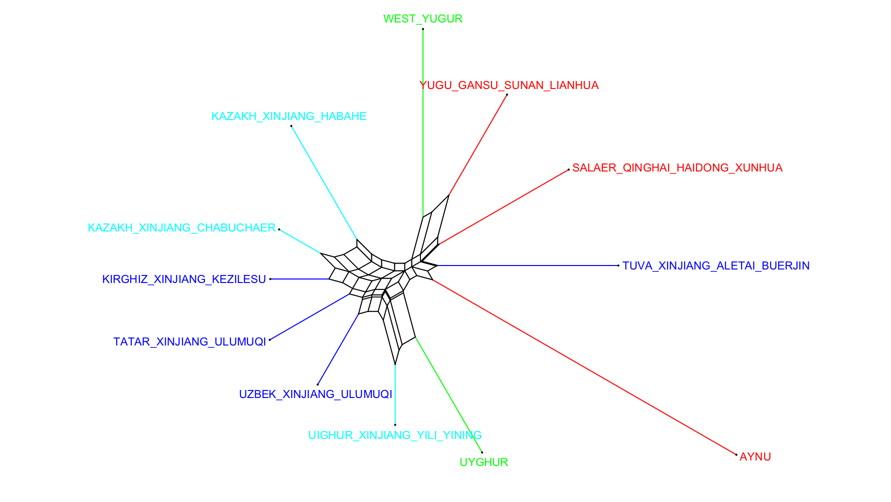

## 用于修改splitstree6的.stree6文件，实现批量添加枝条和标签颜色

- **详细介绍请看：[说明](./HW_读我_处理数据绘制splitstree枝条颜色.md)**

- 结果示例：

**To do list：**
- [ ] 修改字体大小和枝条粗细

 
 
 

splitstree软件链接：
- [splitstree4](https://github.com/husonlab/splitstree4)
- [splitstree6](https://github.com/husonlab/splitstree6)

